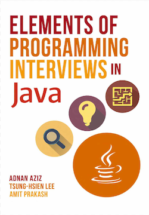

# Elements of Programming Interviews - JAVA & Python
## My solutions & notes from Elements of Programming Interviews

|   |   |
|:---:|:---:|
 | 

## Suggested usage:
+ Purchase Elements of Programming Interviews
+ Fork [EPIJudge](https://github.com/adnanaziz/EPIJudge.git) - get stub programs & test framework
+ Solve a problem & Program your solution to see if the test cases pass
+ Repeat previous two steps until no problems are left

## Dependencies:
+ Python 3 (for my solutions)
+ JAVA 11  (for my solutions)
